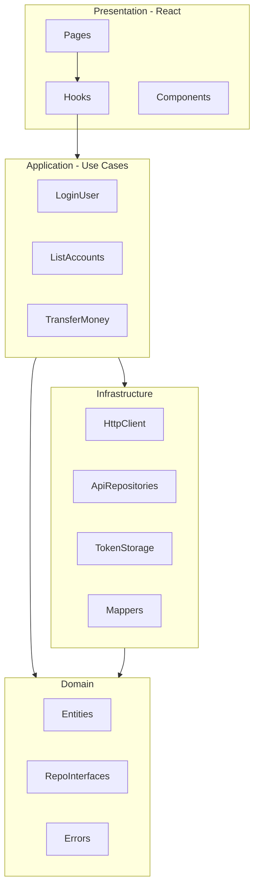

# Arquitectura Frontend (derivada del backend)

**Fecha del análisis:** 16 de septiembre de 2026  
**Alcance:** Propuesta de estructura frontend alineada con Clean Architecture, basada en las capas y convenciones observadas en `CleanArchitecture-G1-fintech-core-app`.  
**Prohibición:** no inventar contratos API; ver `backend-contract.md` para endpoints confirmados.

---

## 1. Hechos observados en el backend

El backend organiza el código en cuatro capas con dependencias unidireccionales:

```
presentation → use-cases → domain ← infrastructure
```

| Capa backend | Responsabilidad observada | Ejemplos |
|--------------|---------------------------|----------|
| **domain** | Entidades, reglas de negocio, interfaces | `Account.ts`, `Transaction.ts`, `Repositories.ts` |
| **use-cases** | Orquestación de flujos | `LoginUseCase.ts`, `TransferMoneyUseCase.ts` |
| **infrastructure** | Detalles técnicos (DB, JWT, Bcrypt) | `PrismaAccountRepository.ts`, `JwtTokenService.ts` |
| **presentation** | HTTP, validación de entrada, respuesta | `AuthController.ts`, `validateRequest.ts` |

**Inyección de dependencias:** manual en `createApp()` (`src/presentation/app.ts:46-90`).

**Validación en borde:** Zod en capa presentation; reglas de dominio en entidades y use cases.

**Manejo de errores centralizado:** `errorHandler` al final del pipeline Express.

---

## 2. Espejo propuesto para el frontend (Clean Architecture)

```
src/
├── domain/              # Modelos de negocio UI-agnósticos, reglas de presentación puras
│   ├── entities/        # User, Account, Transaction (formas de dominio cliente)
│   ├── errors/          # ApiError, DomainValidationError (mapeo de códigos backend)
│   └── repositories/    # Interfaces: AuthRepository, AccountRepository, TransactionRepository
│
├── application/         # Casos de uso del cliente (equivalente a use-cases backend)
│   ├── auth/
│   ├── account/
│   └── transaction/
│
├── infrastructure/      # Implementaciones concretas
│   ├── http/            # ApiClient, interceptors, mapeo HTTP ↔ DTO
│   ├── storage/         # TokenStorage (localStorage/sessionStorage — decisión pendiente)
│   └── mappers/         # Backend DTO → domain entity
│
└── presentation/        # React (Prompt 2 — no implementar aún)
    ├── pages/
    ├── components/
    ├── hooks/           # Adaptadores finos hacia application layer
    └── routes/
```

### Correspondencia backend ↔ frontend

| Backend | Frontend propuesto | Notas |
|---------|-------------------|-------|
| `domain/entities` | `domain/entities` | Mismos conceptos: User, Account, Transaction |
| `domain/repositories` (interfaces) | `domain/repositories` | Contratos que infrastructure implementa |
| `use-cases/` | `application/` | Un use case por flujo de usuario |
| `infrastructure/` | `infrastructure/` | HTTP client, token, mappers |
| `presentation/controllers` | `presentation/` + hooks | Controllers React consumen application layer |
| `presentation/dtos` (Zod) | Validación en forms + opcional shared schemas | Reglas en `backend-contract.md` |

---

## 3. Capas y reglas de dependencia



**Reglas (espejo del backend):**

1. `domain` no importa de `application`, `infrastructure` ni `presentation`.
2. `application` depende de interfaces en `domain`, no de React ni fetch directo.
3. `infrastructure` implementa repositorios definidos en `domain`.
4. `presentation` solo orquesta UI; la lógica de flujo vive en `application`.

---

## 4. Módulos funcionales (bounded contexts del cliente)

Basados en casos de uso expuestos en `src/presentation/app.ts`:

| Módulo | Use cases frontend (propuestos) | Endpoints backend |
|--------|--------------------------------|-------------------|
| **auth** | `RegisterUser`, `LoginUser`, `LogoutUser`, `GetCurrentSession` | `/api/auth/*` |
| **account** | `CreateAccount`, `ListMyAccounts`, `GetAccountBalance`, `FreezeAccount`, `UnfreezeAccount` | `/api/accounts/*` |
| **transaction** | `Deposit`, `Withdraw`, `Transfer`, `GetTransactionHistory` | `/api/transactions/*` |

---

## 5. ApiClient (decisión derivada)

Patrón observado: envelope `{ status, data, message?, code?, errors? }`.

El cliente HTTP debe:

1. Prefijar rutas con base URL configurable (`VITE_API_URL` o equivalente — `[PENDIENTE]` elección de bundler).
2. Inyectar `Authorization: Bearer` desde `TokenStorage` en rutas protegidas.
3. Parsear respuestas de éxito extrayendo `data`.
4. Normalizar errores a `ApiError { httpStatus, code, message, fieldErrors? }` según `ErrorHandler.ts` y `validateRequest.ts`.
5. No acoplar componentes React al formato crudo del backend.

**Fuentes backend:** `ErrorHandler.ts`, `AuthMiddleware.ts`, `validateRequest.ts`

---

## 6. Mappers (decisión derivada)

| Backend shape | Domain entity (frontend) | Mapper responsable |
|---------------|-------------------------|-------------------|
| Login `data.user` + `data.token` | `AuthSession` | `AuthMapper` |
| `AccountOutputDTO` | `Account` | `AccountMapper` |
| `TransactionHistoryItemDTO` | `TransactionRecord` | `TransactionMapper` |
| Envelope error | `ApiError` | `ErrorMapper` |

Campos confirmados en DTOs: ver `src/use-cases/dto/*.ts`.

---

## 7. Decisiones de Clean Architecture a respetar

1. **Separación dominio / infraestructura:** el frontend no debe llamar `fetch` desde componentes; usar repositorios.
2. **Casos de uso como unidad de flujo:** cada acción de usuario = un use case en `application/`.
3. **Validación en capa de borde:** formularios validan con las mismas reglas que Zod del backend (ver `frontend-validation.md`).
4. **Errores tipados por código:** mapear `code` del backend (`INSUFFICIENT_FUNDS`, `ACCOUNT_NOT_FOUND`, etc.) a mensajes UI.
5. **Entidades ricas en cliente:** reflejar estados `ACTIVE`/`FROZEN`, tipos de transacción `DEPOSIT`/`WITHDRAWAL`/`TRANSFER`.
6. **Composition root:** un módulo `di.ts` o factory equivalente a `createApp()` para cablear repos y use cases.

---

## 8. Stack frontend

**[PENDIENTE]** — No hay código frontend en el workspace analizado (`CleanArchitecture-G1-fintech-core-front` vacío).  
El Prompt 2 debe definir framework (React), bundler, router y librería de estado.

---

## 9. [PENDIENTE]

- [ ] Elección de bundler y variable de entorno para API URL.
- [ ] Estrategia de almacenamiento de token (localStorage vs memory + refresh — backend no expone refresh).
- [ ] Generación automática de tipos desde contrato (no hay OpenAPI en backend).
- [ ] Estructura exacta de tests frontend (backend usa Vitest).
- [ ] Internacionalización (mensajes backend en español).

---

## 10. Prohibición explícita

No implementar pantallas, rutas React ni dependencias en esta etapa. No asumir endpoints no documentados en `backend-contract.md`.
