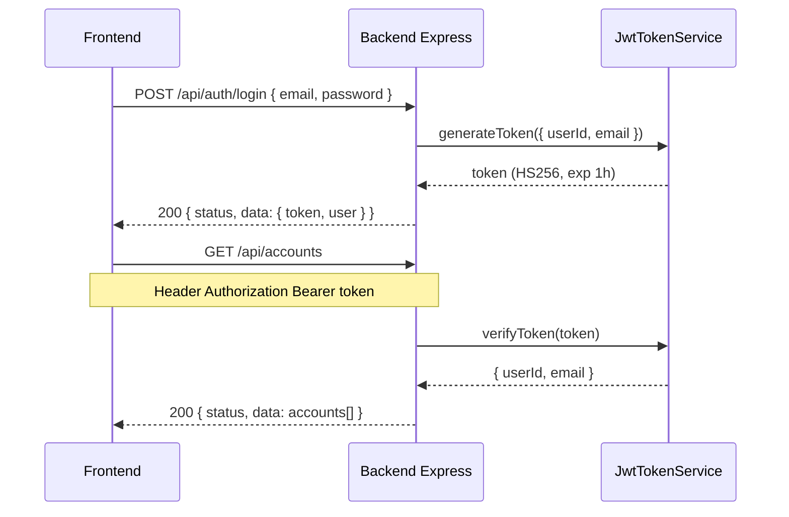
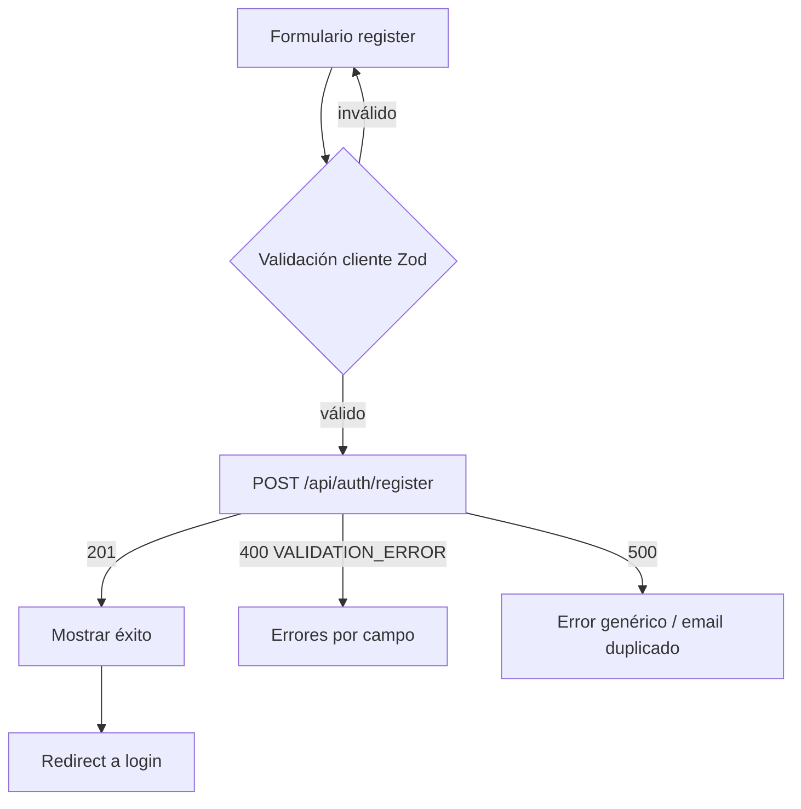
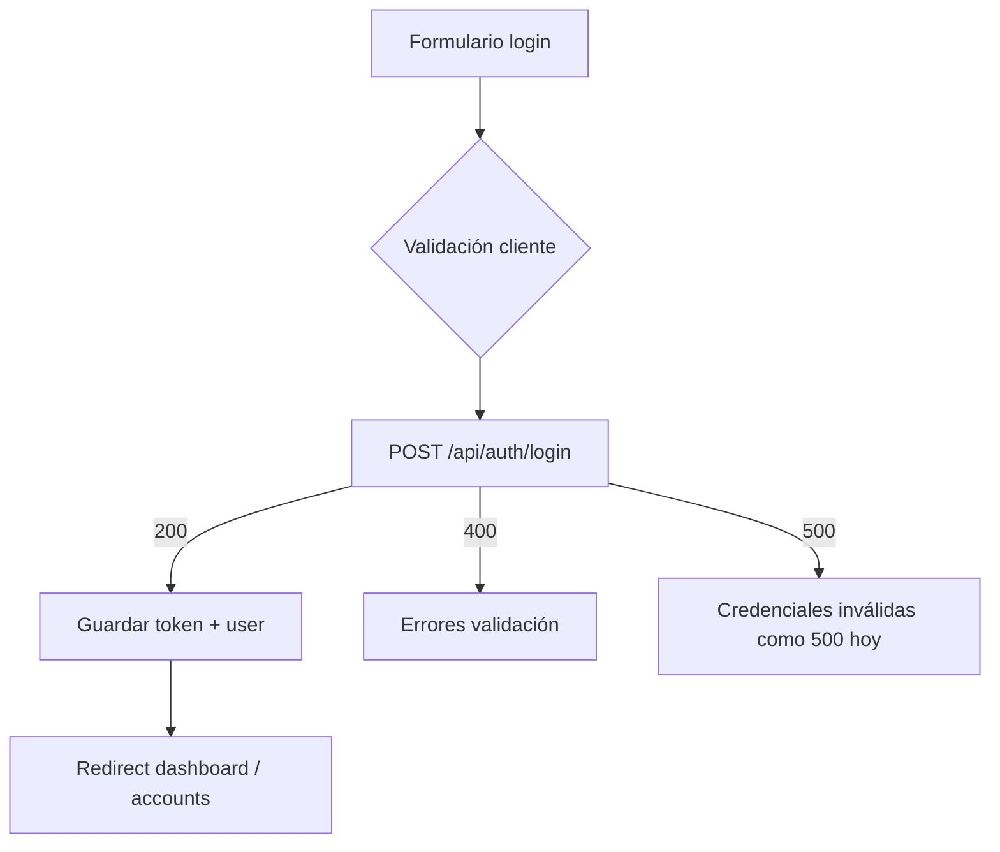
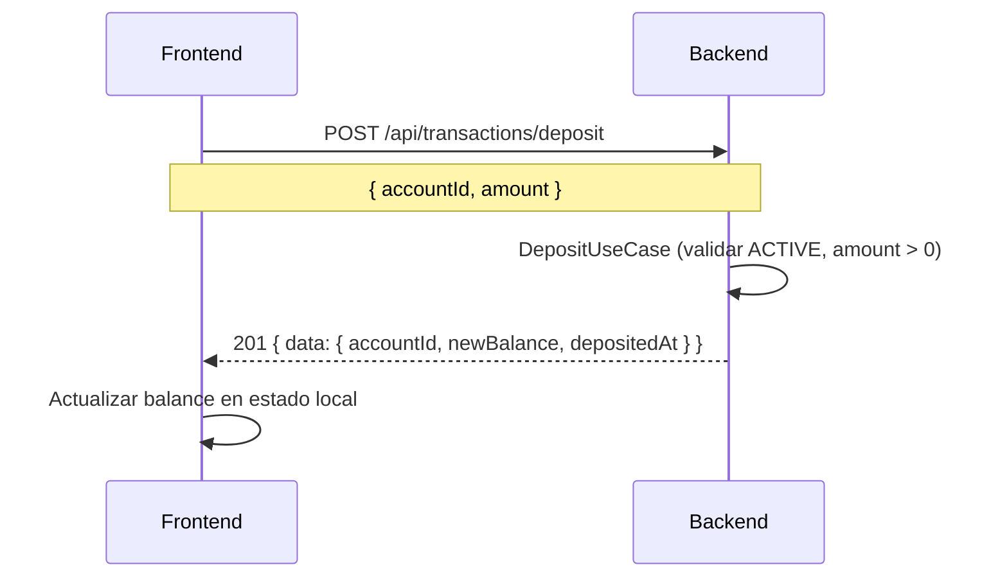
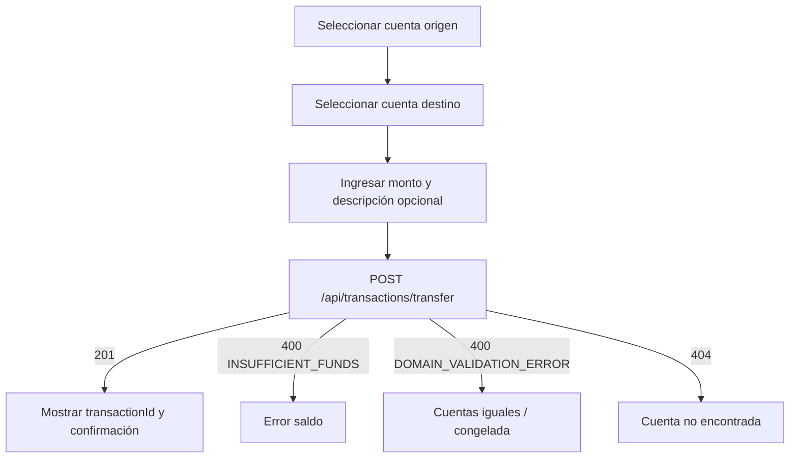
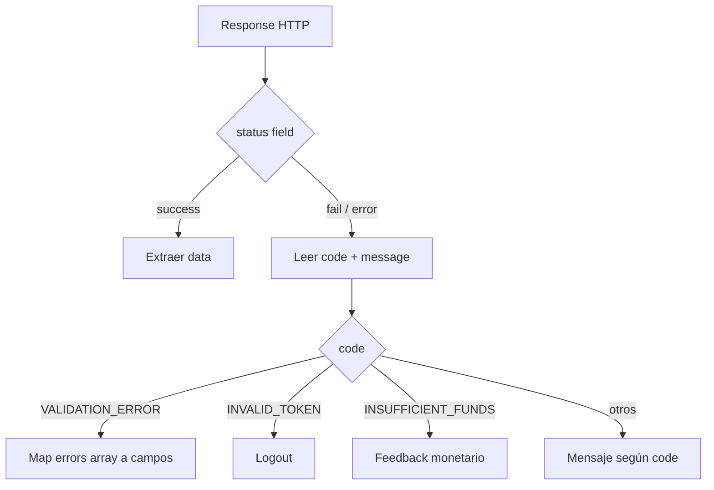

# Flujos de trabajo Frontend (derivados del backend)

**Fecha del análisis:** 16 de septiembre de 2026  
**Alcance:** Flujos de usuario mapeados a endpoints y casos de uso confirmados.  
**Prohibición:** no inventar pasos que requieran APIs no implementadas.

---

## 1. Mapa de autenticación y autorización

### 1.1 Autenticación (confirmada)



**Fuentes:** `LoginUseCase.ts`, `AuthMiddleware.ts`, `JwtTokenService.ts`

### 1.2 Rutas públicas vs protegidas

| Clasificación | Rutas | Middleware |
|---------------|-------|------------|
| **Pública** | `/api/auth/register`, `/api/auth/login` | Solo `validateRequest` (Zod) |
| **Protegida** | Todas las demás `/api/*` observadas | `authMiddleware.handle` |

**Fuente:** `src/presentation/app.ts:93-108`

### 1.3 Autorización (ownership)

**Hecho observado:** no existe verificación de que `req.user.userId` sea propietario de `accountId` en:

- `GET /api/accounts/:accountId/balance`
- `PATCH /api/accounts/:accountId/freeze|unfreeze`
- Operaciones de transacción por `accountId`
- `GET /api/transactions/history/:accountId`

Solo `GET /api/accounts` y `POST /api/accounts` usan `userId` del token.

**Fuentes:** `AccountController.ts`, `TransactionController.ts`, búsqueda sin `403` en `src/`

**Decisión derivada para frontend:** filtrar operaciones a cuentas propias usando `userId` en `AccountOutputDTO`, pero ser consciente de que el backend no impide operar sobre cuentas ajenas si se conoce el UUID.

---

## 2. Flujo: Registro de usuario



**Request confirmado:** `{ name, email, password }`  
**Response confirmada:** `{ status: "success", data: { id, name, email, createdAt } }` — **sin token**.

**Fuentes:** `AuthDTOs.ts`, `AuthController.ts`, `RegisterUserUseCase.ts`

**[PENDIENTE]:** UX post-registro (login automático no soportado por API actual).

---

## 3. Flujo: Login



**Fuentes:** `LoginSchema`, `LoginUseCase.ts`, `LoginUseCase.test.ts`

---

## 4. Flujo: Gestión de cuentas

### 4.1 Listar cuentas del usuario

1. Usuario autenticado navega a vista de cuentas.
2. `GET /api/accounts` con Bearer token.
3. Renderizar lista de `AccountOutputDTO[]`.

**Fuente:** `GetUserAccountsUseCase.ts`, `AccountController.getUserAccounts`

### 4.2 Crear cuenta

1. Usuario pulsa "Crear cuenta".
2. `POST /api/accounts` (body vacío en implementación actual).
3. Response `201` con nueva cuenta (`balance` inicial 0).

**Nota:** `http/accounts.http` sugiere `{ initialBalance }` pero **no está conectado** en controller.

**Fuentes:** `AccountController.ts:18-21`, `CreateAccountUseCase.ts`, `http/accounts.http:25-27`

### 4.3 Consultar saldo

1. Seleccionar cuenta (`accountId`).
2. `GET /api/accounts/:accountId/balance`.
3. Mostrar `data.balance`, `data.status`, `data.accountNumber`.

**Fuente:** `GetBalanceUseCase.ts`

### 4.4 Congelar / descongelar

| Acción | Request | Response |
|--------|---------|----------|
| Congelar | `PATCH /api/accounts/:accountId/freeze` | `{ status, message: "Cuenta congelada correctamente" }` |
| Descongelar | `PATCH /api/accounts/:accountId/unfreeze` | `{ status, message: "Cuenta descongelada correctamente" }` |

**Errores de dominio posibles:**

- Cuenta no encontrada → `404 ACCOUNT_NOT_FOUND`
- Ya congelada / ya activa → `400 DOMAIN_VALIDATION_ERROR`

**Fuentes:** `FreezeAccountUseCase.ts`, `UnfreezeAccountUseCase.ts`, `Account.ts`

---

## 5. Flujo: Depósito



**Precondiciones observadas en backend:**

- Cuenta existe.
- Cuenta `ACTIVE` (no `FROZEN`).
- `amount > 0`.

**Fuentes:** `DepositUseCase.ts`, `DepositMoneySchema`, `TransactionController.deposit`

---

## 6. Flujo: Retiro

Análogo a depósito con validación adicional de saldo suficiente.

**Endpoint:** `POST /api/transactions/withdrawal`  
**Body:** `{ accountId, amount }`  
**Response:** `{ accountId, newBalance, withdrawnAt }`

**Error específico:** `400 INSUFFICIENT_FUNDS`

**Fuentes:** `WithdrawalUseCase.ts`, `WithdrawalMoneySchema`

---

## 7. Flujo: Transferencia



**Body confirmado:**

```json
{
  "sourceAccountId": "uuid",
  "destinationAccountId": "uuid",
  "amount": 150,
  "description": "opcional, max 100"
}
```

**[PENDIENTE]:** si `description` del request se persiste — el use case genera descripción automática (`TransferMoneyUseCase.ts:58`).

**Fuente:** `TransferMoneyUseCase.ts`, `TransferMoneySchema`

---

## 8. Flujo: Historial de transacciones

1. Usuario selecciona cuenta.
2. `GET /api/transactions/history/:accountId`.
3. Renderizar `data.transactions[]` ordenadas por `createdAt` (orden no garantizado en código — `[PENDIENTE]`).

**Tipos mostrables:** `DEPOSIT`, `WITHDRAWAL`, `TRANSFER` con campos condicionales de cuentas origen/destino.

**Fuente:** `GetTransactionHistoryUseCase.ts`

---

## 9. Flujo: Manejo global de sesión expirada

1. Cualquier request protegido recibe `401` con `INVALID_TOKEN`.
2. Frontend limpia sesión.
3. Redirect a login con mensaje.

**No observado:** refresh token, silent renew, endpoint logout.

**Fuente:** `AuthMiddleware.ts`, `JwtTokenService.ts` (`JWT_EXPIRES_IN=1h`)

---

## 10. Flujo de errores HTTP (transversal)



**Fuente:** `ErrorHandler.ts`, `validateRequest.ts`

---

## 11. Orden sugerido de implementación (Prompt 2)

1. Infraestructura HTTP + auth token.
2. Flujos Auth (register → login).
3. Listado y creación de cuentas.
4. Detalle balance + freeze/unfreeze.
5. Depósito y retiro.
6. Transferencia.
7. Historial.

Alineado con dependencias observadas: transacciones requieren `accountId` existente; transferencia requiere dos cuentas.

---

## 12. [PENDIENTE]

- [ ] Flujo de recuperación de contraseña (no existe en backend).
- [ ] Paginación/filtros en historial (no implementados).
- [ ] Ordenamiento garantizado de transacciones.
- [ ] Notificaciones en tiempo real.
- [ ] Multi-tab session sync.

---

## 13. Prohibición explícita

No documentar ni implementar workflows que dependan de endpoints no listados en `backend-contract.md`.
